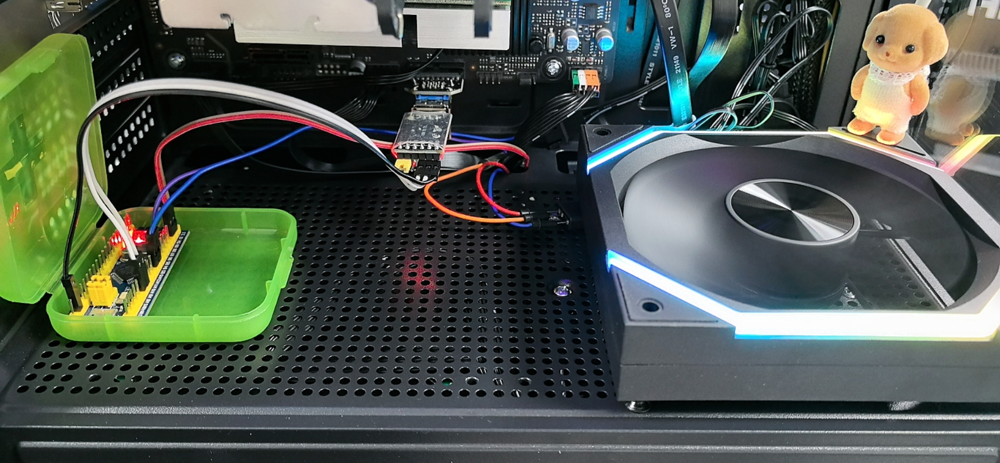
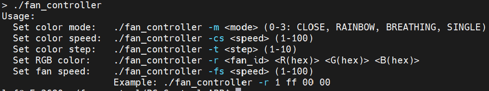

<!--
 * @Author: Li RF
 * @Date: 2025-05-21 14:57:47
 * @LastEditors: Li RF
 * @LastEditTime: 2025-05-21 17:40:38
 * @Description: 
 * Email: 1125962926@qq.com
 * Copyright (c) 2025 Li RF, All Rights Reserved.
-->
# stm32-fan-controller

**基于STM32的智能风扇控制系统 | 支持PWM调速 & 多模式RGB灯光同步**  

Design and Implementation of PC ARGB Fan Controller Based on STM32

 

## 📖 项目简介
本项目是一个基于 **STM32** 微控制器的 **PC ARGB 风扇控制器**，可实现：  
- **PWM调速控制**：通过STM32的PWM输出调节风扇转速。  
- **ARGB灯光控制**：支持多种动态灯光模式（如彩虹渐变、呼吸灯、固定颜色等）。  
- **可编程控制**：通过C代码自定义灯光效果和风扇转速曲线。  
- **USB/UART通信**（可选）：可通过串口或USB与PC通信，实现软件控制。  

适用于 **PC硬件改装、RGB主机、嵌入式学习** 等场景。

---

## 🛠 硬件组成  
- **主控芯片**：STM32F103C6T6A  
- **风扇接口**：  
  - 4Pin PWM风扇（12V）  
  - 3Pin ARGB（5V WS2812B/D可编程LED）  
- **通信接口**（可选）：  
  - USB转串口（CH341/CH340）    
- **电源**：PC电源供电（12V & 5V）  

---

## ⚙️ 软件功能  
### 1. 风扇控制  
- 支持 **PWM占空比调节**（0-100%）。  

### 2. ARGB灯光模式  
- **预设模式**：  
  - 彩虹渐变 🌈  
  - 呼吸灯 💨  
  - 固定颜色 🎨  
- **可扩展**：通过修改代码自定义新效果。  

### 3. 控制方式  
- **串口命令**：通过PC APP软件发送指令。
- **APP 使用**：

---

## 📦 快速开始  
### 硬件连接  
1. 将PWM风扇接至STM32的PWM引脚。  
2. 连接ARGB数据线至STM32 GPIO。  
3. 供电：12V接风扇，5V接ARGB。  

### 软件烧录  
1. 使用STM32CubeIDE编译代码。  
2. 通过ST-Link烧录固件。  

---

## 📂 项目结构  
```
.
├── img
│   ├── app_demo.png
│   └── case_display.jpg
├── LICENSE
├── PC-Control-APP
│   ├── frame_define.c
│   ├── frame_define.h
│   ├── main.c
│   ├── Makefile
│   ├── serial.c
│   └── serial.h
├── README.md
└── STM32-Fan-Control
    ├── Core
    ├── Debug
    ├── Drivers
    ├── fan_conctrol.ioc
    ├── Lib
    └── STM32F103C6TX_FLASH.ld
```

---

## 🌟 未来计划  
- [ ] 添加Wi-Fi/蓝牙远程控制。  
- [ ] 开发Windows控制软件。  
- [ ] 支持更多ARGB协议（如APA102）。  

---

## 📜 开源协议  
本项目采用 **Apache-2.0 License**，可自由修改和商用，但需保留原作者信息。  

---

## 📧 联系与支持  
- **GitHub Issues**：提交问题或建议。  
- **个人博客**：[[链接](https://blog.csdn.net/plmm__)]  
- **邮箱**：1125962926@qq.com  